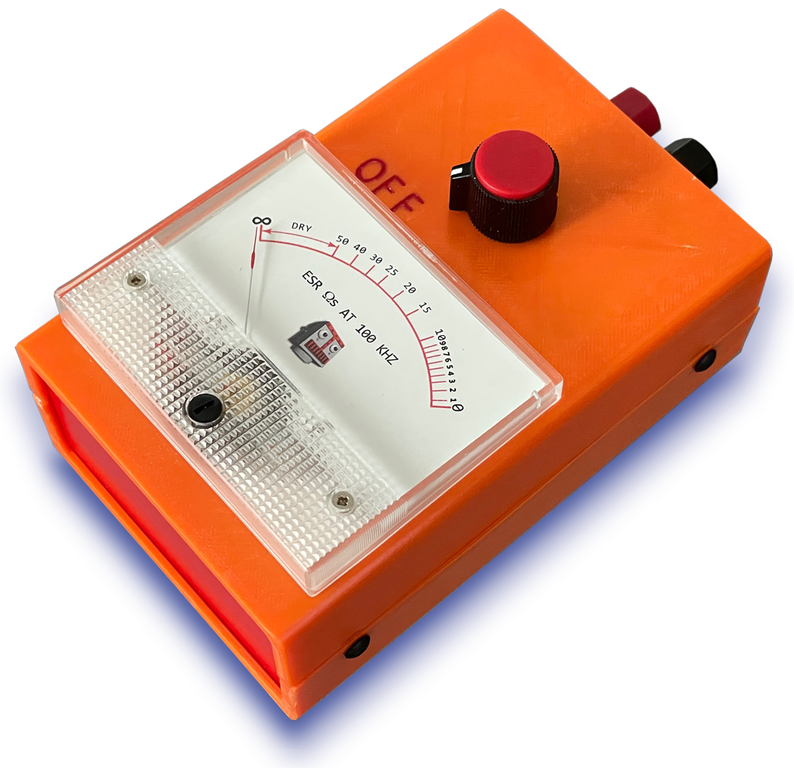
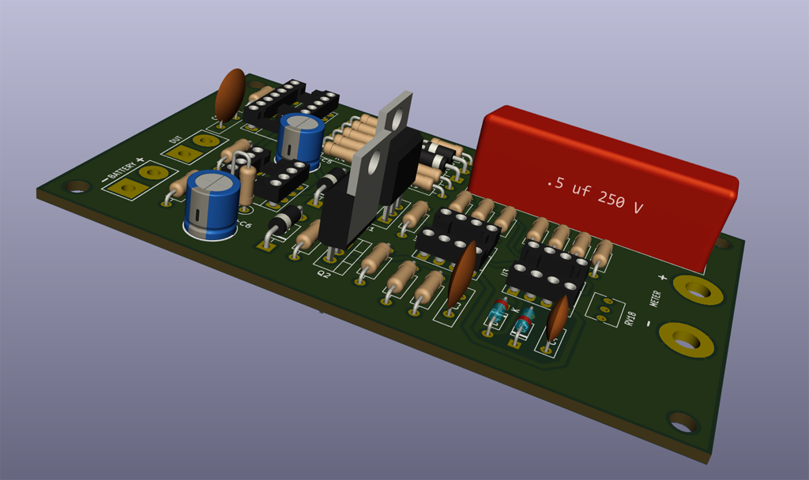
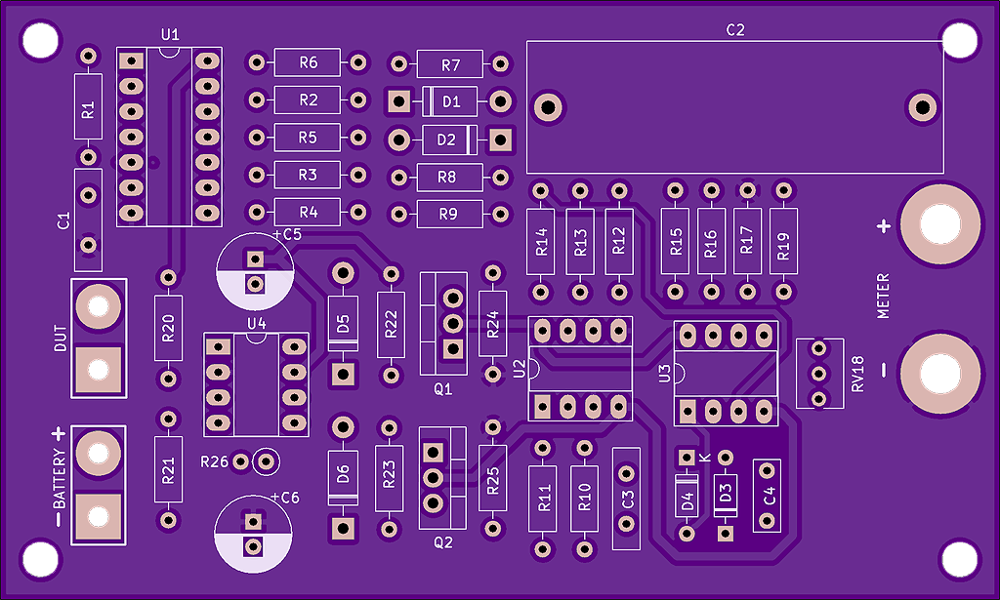
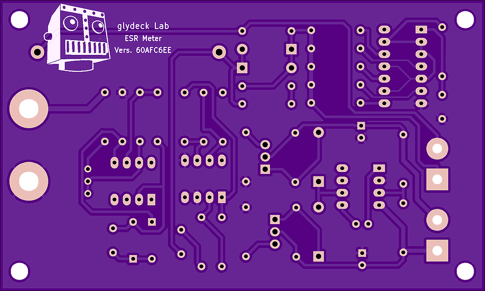
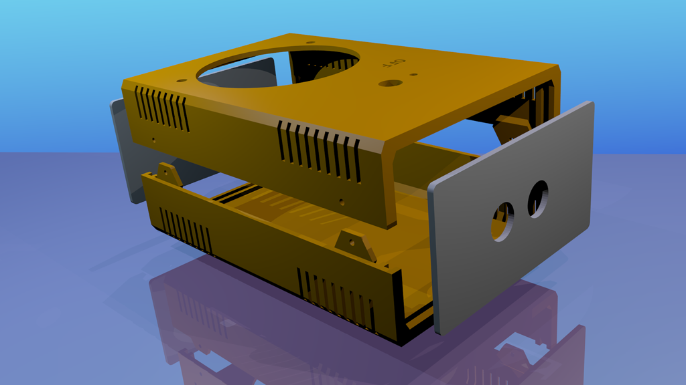
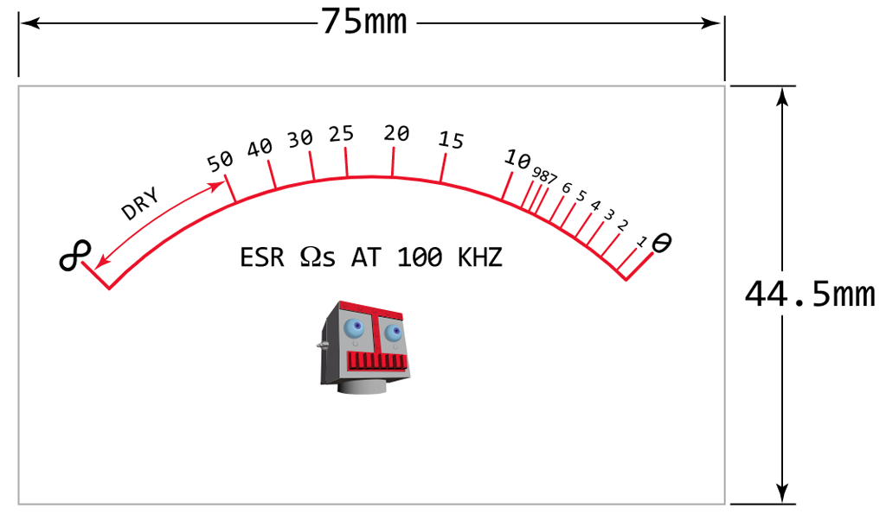
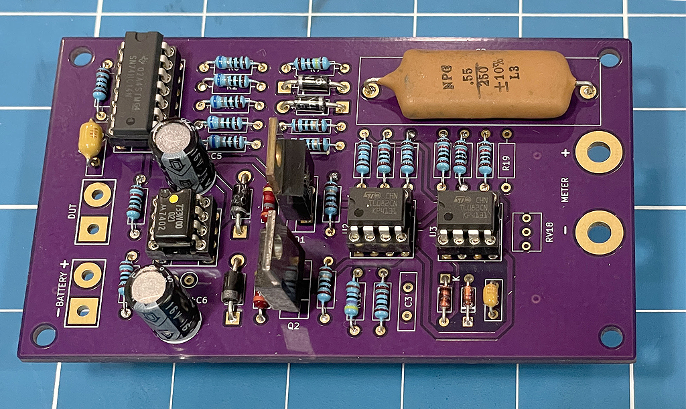
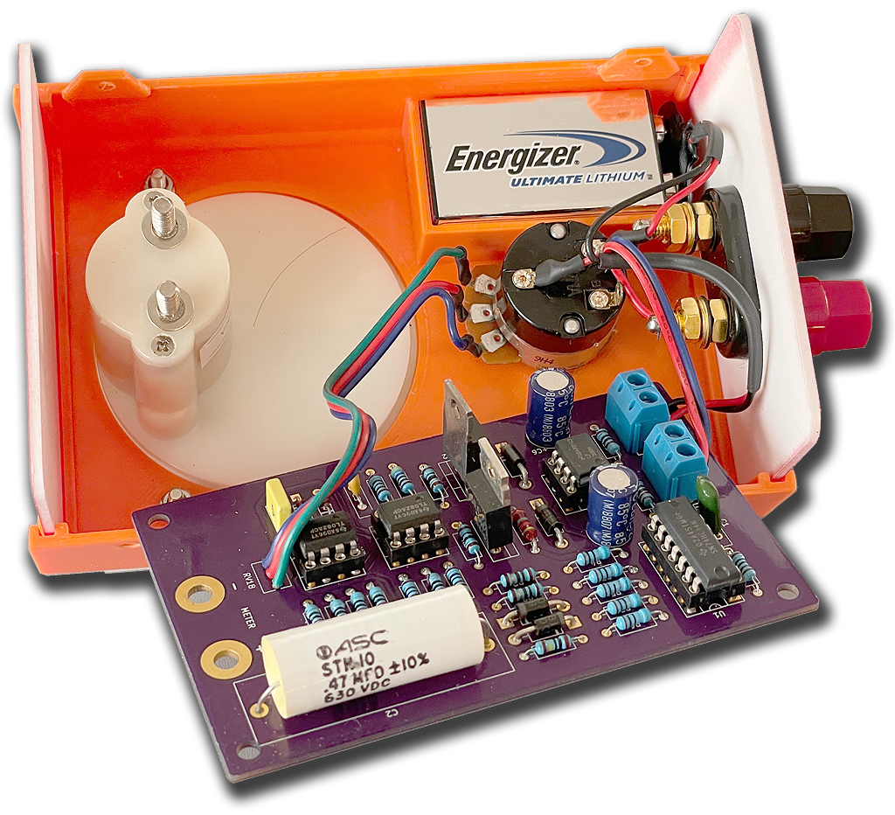
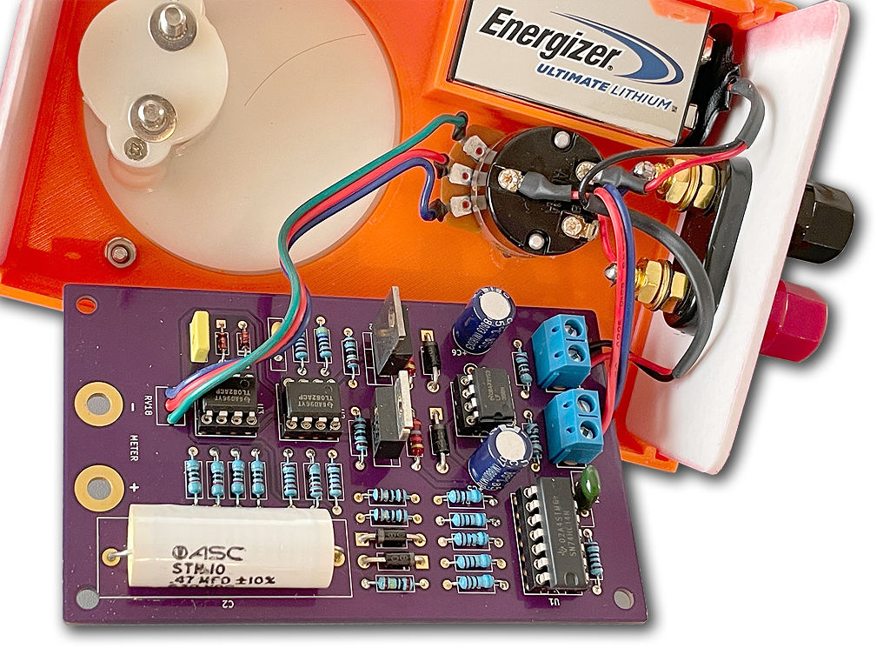
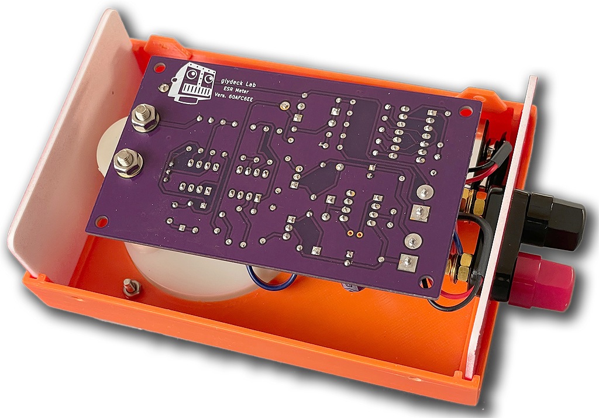

-----------------------------------------------
# Analog ESR Meter
## Created with KiCAD, OpenSCAD, & Inkscape
#### Posted by glydeck 9/12/2024
-----------------------------------------------



## Introduction
The ESR Meter is basically an AC Ohmmeter with special scales and protective circuitry. It provides a continuous reading of series resistance in electrolytic capacitors. It operates at 100 kHz to keep the capacitive reactance factor near zero. The remaining series resistance is due to the electrolyte between the capacitor plates and indicates the state of dryness. Capacitor termination problems also show up plainly due to the continuous ohmic reading.

Additional information including parts list, schematic and circuit description can be found in the file **ESR Meter Manual.pdf**

## Requirements to Make your Own ESR Meter
Versions of the following programs:
- [**KiCad EDA**](https://www.kicad.org/)
- [**OpenSCAD**](https://openscad.org/)
- [**Inkscape**](https://github.com/inkscape/inkscape)
- [**The files in this repository**](https://github.com/glydeck/Analog-ESR-Meter)
## Contents

```
    README.md                -This document
    ESR Meter Manual.pdf     -Details for using the meter
    ESR_Box-OpenSCAD         -OpenSCAD code for the meter case
    ESR_Box-STL              -3D printable files for the case
    ESR_Meter_KicadProject   -KiCad project for circuit board
    ESR_MeterScale           -SVG file for the meter scale
    ESR_resources            -Various PDF files
    images                   -Images used throughout the project
```
### KiCad Project

##### 3D KiCad Rendering


This project uses a depreciated version of KiCad (Version 5.0.2-5 Mac OSX). At some point in the future I hope to update this to a newer version. For now the files for making the PCB are open source on OSH Park.  Boards can be ordered directly from them as well.
- [**OSH Park ESR Meter Boards**](https://oshpark.com/shared_projects/dSvuQNhP)

##### PCB Top View


##### PCB Bottom View


## Meter Case


I found the OpenSCAD code for the case on Thingverse:
- [**Thingverse-Ultimate Box Maker**](https://www.thingiverse.com/thing:2938921)

The original code and conncept can be traced back to the French Blog **Hearty GFX**: 
- [**Hearty GFX**](http://heartygfx.blogspot.com/2016/01/the-ultimate-box-maker.html)
 
The code has been maintained and improved on by Joel Ebel on GitHub:
- [**GitHub-Ultimate Box Maker**](https://github.com/jbebel/Ultimate-Box-Maker)

The **Box Maker** code does not accomidate adding holes to the top or bottom of the case.  It also dose not accomidate custom geometries, such as the battery holder, being added to the inside of the box.

In the OpenScad file **ESR_Box_all.scad** the extra holes in the top of the case and battery holder are included at the end of the file. These added geometries including holes for the meter, potentiometer, added battery cage are included starting on line 419.  The Battery holder runs from line 432 to line 487. The holes for the meter, switch and text are difference geometries subtracted from the case. This code runs from line 496 thru line 569.

## Meter Scale
The Meter scale graphic was created using **Inkscape**.  

## Assembly of ESR Meter
The meter is very easy to assemble.  After stuffing the Printed Circuit Board with components wires can be attached to to the PCB.  These wires can then be attached to the components in the case.  That includes potentiometer with integrated on/off switch, the binding posts and the 9V battery clip.  Two images are provided to show those connections.  When completed the PCB can be turned over and bolted to the back of the meter.  The meter acts as a holding device for the circuit board.

#### Stuffed Board


#### Wiring to Potentiometer, Binding Posts, & Battery Clip


#### Closer View of Internal Wiring


#### Board Attached to the Meter


### ESR Resources
Description of included PDF files relevant to this project:

- Insert Analog_Panel_Meter.pdf - **Meter Cutout**
- sboa068.pdf - **Burr Brown App Note Absolute Value Circuits**
- Schmitt_Trigger_Oscillators.pdf - **Schmitt Trigger Oscillators**
- snoa998.pdf - **Texas Instruments App Note Relaxation oscillator circuit**
- US4216424.pdf - **Untited States Patent for an ESR Meter**
- US6677764.pdf - **United States Patent for Protecting Test Equipment**
